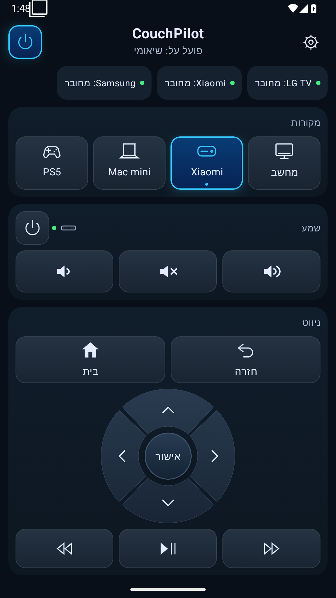
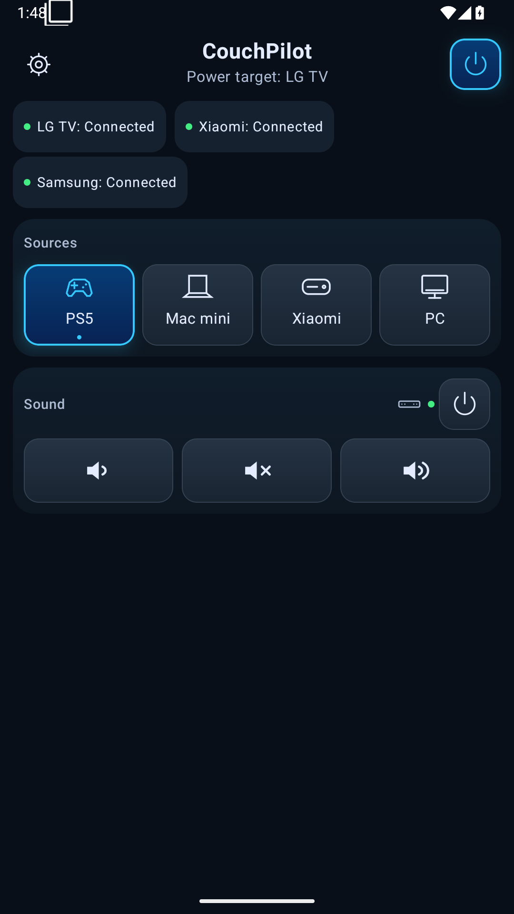
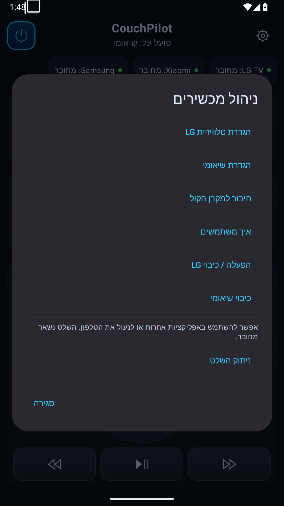

# CouchPilot

CouchPilot is a native Android universal remote that brings LG webOS TV, Google TV, and Samsung soundbar controls into one contextual interface.

Choose an input, change the volume, and use the controls for the selected activity. Xiaomi navigation, media and yes+ channels appear only when Xiaomi is selected. Setup lives in device management; no account, cloud service or separate CLI is needed for everyday control.

<p>
  
  
  
</p>

Screenshots use emulator fixtures, not live device connections. English and Hebrew/RTL are supported.

## Why it exists

One phone should handle TV inputs, streamer navigation and sound without exposing three protocol panels during normal use. CouchPilot combines LAN and Bluetooth adapters behind device-neutral interfaces and keeps established connections alive while you use other apps.

## Hardware and features

### Tested hardware

| Device | Physically observed | Limitations |
| --- | --- | --- |
| LG 55UK6700YVD | Approval/registration, HDMI switching, off, network wake after enabling Turn on via Wi-Fi | Saved TV MAC required; extended standby reliability not measured |
| Xiaomi TV Box S (3rd Gen) | Classic Bluetooth HID connection/control; TV input selection wakes via HDMI-CEC | Phone LAN path was unreachable before TLS; LAN pairing/control not physically established |
| Samsung HW-M360 | Volume up/down, mute/unmute, off; optical Auto Power Link wake with TV | Independent Bluetooth wake failed; optical D.IN and TV wake prerequisites apply |

Latest automatic post-wake reconnection has deterministic tests but no separate physical confirmation. See [device validation](docs/DEVICE_VALIDATION.md) for failed and superseded attempts.

### Protocol-compatible / may work

Other LG webOS TVs exposing SSAP/WSS and Google TV/Android TV Remote Service v2 devices may work, but have not been physically validated here. Android Bluetooth HID Device requires API 28+ and OEM support. Samsung reverse-engineered frames are specific to HW-M360; other soundbars are not claimed compatible.

| Feature | Implementation |
| --- | --- |
| Sources | PS5 → HDMI_1; Mac mini → HDMI_2; Xiaomi → HDMI_3; PC → HDMI_4 |
| Google TV | D-pad/OK, Back/Home, media, digits and channel keys over LAN v2 or explicitly selected HID |
| yes+ | Numeric channels, channel up/down and Previous channel (long OK then short OK); app layout dependent |
| Sound | Samsung volume/mute, status-confirmed commands |
| Power | Explicit current target; LG WOL, Xiaomi standby/CEC wake, Samsung off/optical wake |
| Recovery | Saved credentials/bonds, bounded pending taps, per-device ordering and independent command workers |

CouchPilot does not launch yes+ automatically, detect the foreground streamer app, control PS5/PC navigation or provide Power Off All.

## Build and install

Use JDK 25 (validated), Android SDK platform 37 and the checked-in Gradle wrapper 9.6.0. Language bytecode targets Java 17. Minimum Android 8/API 26; Bluetooth HID needs API 28+. Target SDK 36.

```sh
git clone https://github.com/tzvika-por/CouchPilot.git
cd CouchPilot
# Set ANDROID_HOME or create ignored local.properties with sdk.dir.
./gradlew assembleDebug
./gradlew test lint assembleAndroidTest
./gradlew assembleRelease :app:lintRelease
```

Debug APK: `app/build/outputs/apk/debug/app-debug.apk`. Release compilation produces an unsigned APK. There is no signed stable release yet; [signing and upgrade continuity](docs/RELEASE_SIGNING.md) must be resolved before distribution. Existing development installs retain `com.myremote.app`; the visible rename preserves pairing storage.

## Setup

1. Open device management and configure LG: discover/select or enter a local host, then approve on the TV. Stored approval is reused.
2. For LG wake, save its MAC address in LG setup and enable the TV's network wake setting. Previously persisted wake addresses are retained.
3. Configure Xiaomi using LAN discovery/manual host plus TV pairing code. If your LAN path is blocked, supported phones can use Classic HID: reuse a saved Android bond, or explicitly configure the box's Bluetooth address and approve first pairing. No household address is built into the app.
4. Pair Samsung through Android Bluetooth settings, grant nearby-device connection permission, and select the soundbar. Keep optical D.IN and close Samsung Audio Remote while CouchPilot owns the connection.

Power names its target. Device management also offers explicit LG power, so a sleeping TV remains wakeable while Xiaomi is selected. Volume always controls Samsung. The foreground connection notification provides a stop action; stopping connections does not switch devices off.

## Architecture

Compose → process-owned `RemoteSession` → bounded per-device `CommandScheduler` → `RemoteCoordinator` → `TvController`, `StreamerController`, `SoundbarController`. Adapters own discovery, registration, transport, credentials and reconnect. No protocol implementation lives in Compose. [Architecture](docs/ARCHITECTURE.md), [LG](docs/LG_WEBOS_PROTOCOL.md), [Google TV](docs/GOOGLE_TV_PROTOCOL.md), [Bluetooth HID](docs/XIAOMI_BLUETOOTH_PROTOCOL.md), [Samsung](docs/SAMSUNG_M360_PROTOCOL.md).

## Privacy and security

No analytics, ads, telemetry, accounts or cloud command service. Keys stay in Android Keystore; LG grants are encrypted and all pairing storage is excluded from backup. Saved TLS pins are strict. Initial LG trust and legacy Samsung RFCOMM have protocol limitations. Production connections are restricted to LAN address scope; unauthenticated discovery is not authorization. Release logcat does not emit command traces. [Security model and residual risks](docs/SECURITY.md).

## Quality and limitations

Exact final counts and commands are recorded in [validation](docs/FINAL_VALIDATION.md). CI builds debug/unsigned release, runs JVM tests/lint and compiles instrumentation; the separate emulator workflow runs the UI/screenshot/native API suite. Emulators do not establish OEM interoperability.

Wi-Fi isolation/filtering can prevent discovery or control even on apparently shared subnets. Wake depends on TV/CEC/optical settings. Unknown power/mute state is not inferred from a successful packet write. No standalone Xiaomi wake over a disconnected HID channel is claimed. LG WebSocket size checks occur after OkHttp assembles the message, leaving a malicious selected peer memory-exhaustion risk. This candidate remains pre-1.0 pending that availability hardening and distribution/signing decisions.

## Contributing and license

See [CONTRIBUTING.md](CONTRIBUTING.md) and [third-party notices](docs/THIRD_PARTY_NOTICES.md).

Licensed under the Apache License, Version 2.0. SPDX: **Apache-2.0**. See [LICENSE](LICENSE).
